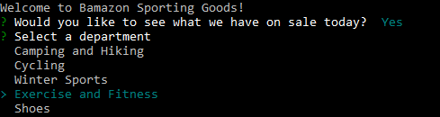
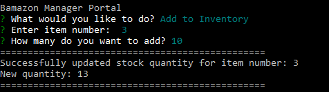
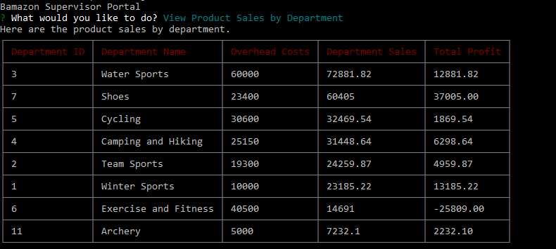
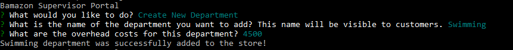
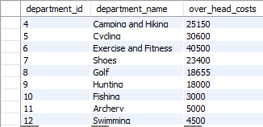

# Bamazon Sporting Goods

## Table of contents
  * [Demo](#demo)
  * [About this project](#about-this-project)
  * [Getting started](#contribute)
  * [App workflow](#app-workflow)
  * [Technologies used to create app](#technologies-used)
  * [Future code development](#feature-enhancements)
  * [Issues](#issues)

##  Demo
* Customer Portal:
* Manager Portal:
* Supervisor Portal:

##  About this project
This project is a command line application built using Node.js, Javascript, the inquirer npm package, and a MySQL database. It is an Amazon-like storefront (hence, the name Bamazon) that takes in customer orders on various sporting goods and outdoor items through the Bamazon Customer Portal. When a customer order is taken in the Customer Portal, the stock quantity for the product that is being purchased decreases by how much of that product the customer decides to buy. 

Managers can also use this application through the Bamazon Manager Portal. In the Bamazon Manager Portal, managers can see all the products that are currently being sold in the store, see all products that are low in inventory (that is, stock quantity is less than 5), add inventory to an existing product, and add a new product to the store.

Finally, the Bamazon Supervisor Portal allows store supervisors to track product sales across departments as well as see a summary of the highest-grossing departments in the store. From this portal, supervisors also are able to create a new department if desired.

##  Getting started
To set up this application on your own computer, perform the following steps:
  1. [Clone the repository](#clone-repository)
  2. [Install Node.js](#install-node)
  3. [Install MySQL Workbench](#install-mysql)
  3. [Install the dependencies](#dependencies)
  4. [Set up database](#database-setup)
  5. [Create a .env file to store MySQL password](#create-env)

###  Clone the repository
The first step is to clone the project repository to a local directory on your computer. To clone the repository, run the following commands:
<pre>
  git clone https://github.com/philipstubbs13/Bamazon.git
  cd Bamazon
</pre>

###  Install Node.js

If you don't already have Node.js installed on your computer, you can install the latest version here: https://nodejs.org/en/.

###  Install MySQL Workbench

If you don't already have MySQL Workbench installed on your computer, you can install the latest version here: https://www.mysql.com/products/workbench/

For this project, MySQL Workbench is used to visually design, create, and manage the database used to store product and department data.

####  Structure of the project

After you clone the repository, navigate to the project root directory (Bamazon). The project directory structure is set up as follows:

<ul>
  <li> 
  	
<b>BamazonCustomer.js</b>: Bamazon Customer Portal Node Application. Running this application displays information for all of the items on sale, including item number, product name, department name, and product price.

  	
When customer order is processed, stock quantity and product sales are updated in the database, and the amount that the customer's account is charged is displayed on the screen.

  </li>
  <li>
  	
<b>BamazonManager.js</b>: Bamazon Manager Portal Node Application. Running this application displays a list of menu options that store managers can choose from. This application allows managers to view all the products for sale, view products that are low in inventory, add inventory, and add a new product to the store. 

  </li>
  <li>
  	
<b>BamazonSupervisor.js</b>: Bamazon Supervisor Portal Node Application. Runing this application displays a list of menu options that store supervisors can choose from. This application allows supervisors to add a new department to the store by providing information through a series of inquirer prompts.

  	
This application also allows supervisors to see a summary (in table format) of product sales by department. Total profit is also displayed in the same table. Total profit is equal to department product sales minus department overhead costs. Note that total profit is calculated on the fly and is stored outside of the database.

  </li>
  <li>
  	
<b>schema.sql</b>: The database schema. The schema is what describes the structure of each table, and the datatypes that each column of the table can contain. For this project, the database includes two tables, a products table and a departments table.

  	<ul>
  		<li>
  			
The products table contains information about each product that is sold in the store, including item number/id, product name, department name, price, stock quantity, and product sales.

  			
  		</li>
  		<li>
  			
The departments table contains information about each department in the store, including deparment number, department name, and overhead costs.

  			
  		</li>
  	</ul>
  	
In the Supervisor Portal, the products table and departments table are joined to calculate product sales and total profits for each department.

  	
  </li>
  <li><b>package.json</b>: Lists the project dependencies (third party npm packages) and their version numbers.</li>
  <li><b>.gitignore</b>: Any file or directory listed inside this file will not be tracked by GitHub when code is committed.</li>
  <li><b>package-lock.json</b>: Dependency tree for the project. Lists all the dependencies and their versions.</li>
</ul>

###  Install the dependencies

The following npm packages are dependencies to the project. You must install these packages in the project root directory (Bamazon) to be able to use this application from the command line.

After you clone the repository to a local directory, change directory to the project root directory (Bamazon) and run the following command to install the required npm packages:

<pre>npm install</pre>
<ul>
	<li>inquirer npm package (https://www.npmjs.com/package/inquirer) - used to prompt customers when purchasing a product, managers when adding inventory or adding a new product, and supervisors when adding a new department. </li>
	<li>cli-color npm package (https://www.npmjs.com/package/cli-color) - used to add color to the application.</li>
  	<li>mysql npm package (https://www.npmjs.com/package/mysql) - used to create a connection to the MySQL database via the command line.</li>
  	<li>cli-table npm package (https://www.npmjs.com/package/cli-table) - used to render tables on the command line from node.js scripts.</li>
  	<li>dotenv npm package (https://www.npmjs.com/package/dotenv) - used to retrieve the MySQL password from a .env file and pass the value to the application when running it from the command line.</li>
</ul>

Version information for each of these packages is available in the package.json file in the project root directory.

##  Set up database
To set up a database that you can use with this application, perform the following steps:
<ol>
<li>
Open the schema.sql file in the project root directory and paste the contents of this file into MySQL Workbench.
</li>
<li>
Execute the following statements:

<pre>
CREATE DATABASE bamazon;

USE bamazon;
</pre>

Running these statements creates a database called bamazon and sets it as the current database being used.

</li>
<li>
Execute the following statement to create a table called products.

<pre>
CREATE TABLE products (
	-- Unique id for each product --
    item_id INT(11) AUTO_INCREMENT NOT NULL,
    -- Name of product --
	product_name VARCHAR(100) NOT NULL,
    -- Department name --
	department_name VARCHAR(100) NOT NULL,
    -- Cost to customer --
	price DECIMAL(10,2) NOT NULL,
    -- How much of the product is available in stores. --
	stock_quantity INT(11) NOT NULL,
    -- Make item_id the primary key --
    product_sales DECIMAL (10,2) NOT NULL,
	PRIMARY KEY (item_id)
);
</pre>

This table includes columns for item number, product name, price, stock quantity, and product sales.

</li>

<li>
To populate the products table with product information, execute the following statement:

<pre>
INSERT INTO products (product_name, department_name, price, stock_quantity, product_sales)
VALUES ("Downhill skis", "Winter Sports", 225.89, 35, 0), 
("Under Armour Stephen Curry Indoor/Outdoor Basketball", "Team Sports", 29.00, 25, 0),
("Kayak", "Water Sports", 149.89, 20, 0),
("Hockey stick", "Winter Sports", 68.88, 37, 0),
("Paddleboard", "Water Sports", 299.99, 18, 0),
("Tent", "Camping and Hiking", 39.79, 23, 0),
("Backpack", "Camping and Hiking", 35.49, 15, 0),
("Mountain Bike", "Cycling", 131.99, 10, 0),
("Hockey skates", "Winter Sports", 69.99, 22, 0),
("Fitbit Flex 2", "Exercise and Fitness", 59.00, 14, 0);
</pre>
</li>

<li>
Execute the following statement to create a second table called departments.

<pre>
CREATE TABLE departments (
	-- Unique id for each department --
    department_id INT(11) AUTO_INCREMENT NOT NULL,
    -- Name of department --
	department_name VARCHAR(100) NOT NULL,
    -- Dummy number set for each department --
	over_head_costs VARCHAR(100) NOT NULL,
	PRIMARY KEY (department_id)
);
</pre>

This table includes columns for department number, department name, and department costs.

</li>

<li>
To populate the departments table with department information, execute the following statement:

<pre>
INSERT INTO departments (department_name, over_head_costs)
VALUES ("Winter Sports", 10000),
("Team Sports", 19300),
("Water Sports", 60000),
("Camping and Hiking", 25150),
("Cycling", 30600),
("Exercise and Fitness", 40500);
</pre>
</li>
</ol>

##  Create a .env file to store MySQL password
To connect to the MySQL database via the command line, you need to provide your own .env file.

Create a file named .env in the project root directory (Bamazon) with the following contents. Replace <i>mysql_password</i> with your actual MySQL password.

<pre>
# MySQL Password

MYSQL_PASSWORD='<i>mysql_password</i>'
</pre>

This file will be used by the dotenv npm package, which will pass the password value as an environment variable to the global process.env object in node. Because .env is specified in the .gitignore file, the MySQL password won't be pushed to GitHub — keeping the password information private.

##   Create database connection

In the bamazonSupervisor.js, bamazonManager.js, and bamazonCustomer.js files, there are database connection properties defined that are used to create a connection to the MySQL database. Update the connection properties to reflect your database instance, as shown in the following example.

<pre>
//Create connection to mysql database.
//Read mysql password from the .env file.
var connection = mysql.createConnection({
	host: "localhost",
	port: 3306,
	user: 'root',
	password: process.env.MYSQL_PASSWORD,
	database: 'bamazon'
});
</pre>

##  App workflow

The application includes three user portals.

<ul>
	<li>Customer Portal</li>
	<li>Manager Portal</li>
	<li>Supervisor Portal</li>
</ul>

The following sections describe the user workflow for each of these portals.

### <a name="customer-workflow"> Customer workflow

The Customer Portal is where customers can browse products by department and make purchases.

#### Accessing the Customer Portal

To access the Customer Portal, run the following command:

<pre>node bamazonCustomer.js</pre>

When you run this command, you will see a welcome message and be asked if you want to see what is on sale today.

Enter <b>Y</b> to continue to the Customer Portal.

#### Selecting a department

After you are in the Customer Portal, you will be prompted to select a department.

After you select a department, all the items for sale within that department will be displayed, and you will be prompted to make a purchase, select another department, or exit the store.

#### Making a purchase

To make a purchase, you need to enter the item number for the item you want to purchase and the quantity (how much you want to purchase).

After your order is placed, enter Y to confirm and complete the purchase.

After you confirm the purchase, the order details, including the amount your account was charged, will be displayed on the screen.

### <a name="manager-workflow"> Manager workflow

In the Manager Portal, a store manager can perform several tasks. They can view all products sold, view items that have low inventory, add inventory, and add a new product.

#### Accessing the Manager Portal

To access the Manager Portal, run the following command:

<pre>node bamazonManager.js</pre>

When you run this command, you will see a list of menu options.

#### View Products for Sale

When you select <b>View Products for Sale</b> from the menu, you will see a table that lists all of the products for sale along with what department the product belongs to, the price of each product, and the in-stock quantity for each product.

#### View Low Inventory

When you select <b>View Low Inventory</b> from the menu, you will see a table that lists all of the products in the products table in the database that have a stock quantity of less than 5.

#### Add to Inventory

When you select <b>Add to Inventory</b> from the menu, you will prompted to enter the item number for the product you want to add stock to as well as how much stock.

The stock quantity for the item number entered at the prompt is updated in the products table in the database.

If you enter an item number that is not currently associated with any product in the store, you will get an error message that the item was not found. The application will take you back to the manager menu.

#### Add New Product

When you select <b>Add New Product</b> from the menu, you will be prompted to enter information about the product you want to add to the store. This information is used to run the INSERT INTO MySQL statement to add the product to the products table in the database.

#### Exit Application

To exit the Manager Portal, select <b>Exit Manager Portal</b> from the menu.

### <a name="supervisor-workflow"> Supervisor workflow

 In the Supervisor Portal, a store supervisor can create a new department and view product sales by department.

#### Accessing the Supervisor Portal
To access the Supervisor Portal, run the following command:
<pre>node bazamonSupervisor.js</pre>

When you run this command, you will see a list of menu options.

<pre>
BAMAZON SUPERVISOR PORTAL
? What would you like to do? (Use arrow keys)
> View Product Sales by Department
  Create New Department
  Exit Application
 </pre>

#### View Product Sales by Department

If you select <b>View Product Sales by Department</b> from the menu, you will see a table of all the departments and information about those departments, including overhead costs, department sales, and total profit.

To get this information from the database, a connection query needs to be constructed to join the departments table and products table.

<pre>
SELECT DISTINCT departments.department_id, departments.department_name, 
departments.over_head_costs, SUM(products.product_sales) as department_sales
FROM departments
INNER JOIN products ON (departments.department_name = products.department_name)
GROUP BY department_name
ORDER BY department_sales desc;
</pre>

In this query, note the following:

<ul>
	<li>The department_id, department_name, and overhead_costs columns are selected from the departments table.</li>
	<li>The SQL SUM function is used to calculate product sales for all the products in a department. The SUM of the product sales from the products table for each department is selected. This information is stored using the alias department_sales.</li>
	<li>Adding DISTINCT to the query ensures that there are no duplicate departments in the joined table.</li>
	<li>INNER JOIN is used to join from the departments table where deparment name from departments table equals department name from products table.</li>
	<li>This query groups the table by the department_name column.</li>
	<li>This query orders the results by the department_sales column (that is, from highest sales to lowest)</li>
</ul>

When this query is executed against the products table and the departments table, a joined table similar to the following example is returned.

Looking at this joined table, you will notice that total profit is not stored in the database. Total profit is calculated on the fly by taking the difference between department sales and overhead costs.

#### Create New Department

If you select <b>Create New Department</b> from the menu, you will be taken through a series of inquirer prompts to provide information about the department you want to add to the store.

The new department is added to the departments table in the database.

<b>Note: </b> The new department won't show up in the joined table (Supevisor selects 'View Product Sales by Department') until a manager adds a product to this department through the Manager Portal.

#### Exit Supervisor Portal
To exit the Supervisor Portal, select <b>Exit Application</b> from the menu.

##  Technologies used to build app

  * Node.js (https://nodejs.org/en/)
  * Javascript
  * MySQL (https://www.mysql.com/)

##  Future code development

Source code will be developed over time to handle new features.

The following is a list of potential feature enhancements:

<ul>
	<li>Create a mySQL login system that prompts users for a username and password.</li>
	<li>Add option to Manager Portal to remove product from store.</li>
	<li>Add option to Supervisor Portal to remove department from store.</li>	
</ul>

##  Issues

If you find an issue while using the app or have a request, <a href="https://github.com/philipstubbs13/Bamazon/issues/" target="_blank">log the issue or request here</a>. These issues will be addressed in a future code update.
